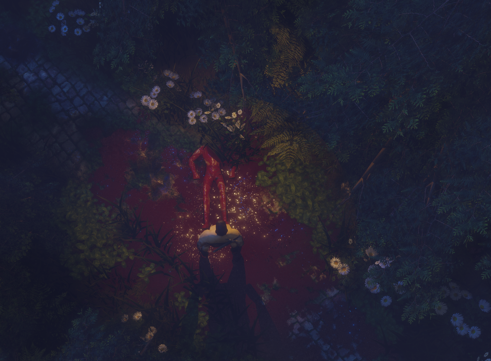
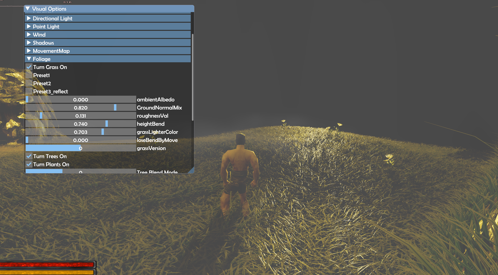
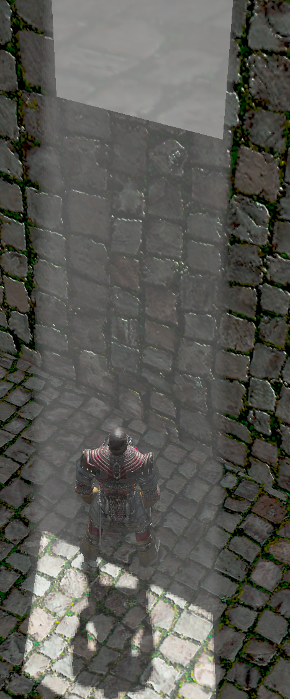

# Game 3D

# Project Description
This is a **3D action RPG game** in which I experiment with advanced graphical effects and custom systems to create an **engaging, dynamic, and visually polished** gameplay experience. A key focus of the project is **optimization**, ensuring that the game not only looks great but also runs smoothly across different hardware configurations.  

Currently, I treat this project as a **playground** for developing my skills. After completing my first, relatively simple 3D application – **Patapon 3D**, I decided to take on a **more ambitious challenge**. My goal is to **implement advanced algorithms and graphical effects** while simultaneously learning **efficient patterns for CPU-GPU collaboration** to fully leverage the available hardware potential.

Below are some example screenshots of the application.

## Technologies and Libraries Used:

    C++ – The programming language in which the application was created.
    OpenGL – A graphics API that enables 3D rendering with programmable pipeline.
    Dear ImGui - A graphical user interface library for C++.
    Simple DirectMedia (SDL) - A cross-platform development library designed to provide low level access to audio, keyboard, mouse, joystick, and graphics hardware via OpenGL.
    OpenGL Mathematics (GLM) - Mathematics library for graphics software based on the OpenGL Shading Language (GLSL) specifications.
    Open Asset Import Library - Library to load various 3d file formats into a shared, in-memory imediate format.
    
## Application Features:

    World Creator tool for painting objects materials, adding foliage and static objects to world.
    Foliage move animation based on dynamic entities position and wind
    Dynamic mesh slicing system (limb lost on melee fights)
    Volumetric light and fog
    PBR and IBL
    SSAO on forward renderer
    Bloom renderer - Based on a presentation from the Call Of Duty Advanced Warfare 2014 game
    Some fancy cache friendly trees like octtree or bvh for culling objects before sending to buffers
    Good data organization (buffer orphaning and others)

# Author

Project was created by [Barnaba]. 

[GitHub: Barnaba](https://github.com/JakubDz4)

# Credits

In this project, I use various models, materials, and animations that are not my own. Some of the assets listed here have been slightly modified by me, which will be appropriately indicated when crediting the authors.

Oak Trees by DJMaesen: https://sketchfab.com/3d-models/oak-trees-d841c3bcc5324daebee50f45619e05fc

Conifer Trees [modified] by Sereib: https://sketchfab.com/3d-models/conifer-medium-poly-38fb9cc46832422fb9bded278134ad83

Clovers [modified] by Studio Lab: https://sketchfab.com/3d-models/clovers-plants-foliage-d68dc45e329e48e3bc83ecc5448a6c25

Daisy by Evolveduk: https://sketchfab.com/3d-models/daisy-bb3f6ca7d00a489b9a356fb88f011565

Most animations, models and textures are from game: Gothic 2 night of the raven [modified]
